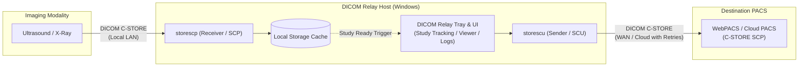

# DICOM Relay

A lightweight, reliable Windows system tray application that wraps DCMTK's `storescp` and `storescu` command-line tools into an automated store-and-forward DICOM relay for clinical and veterinary imaging environments.

---

## Overview

In many clinical environments, modalities such as ultrasound machines, CR/DR readers, or endoscopy systems need to transfer studies to a central or cloud-based WebPACS. When the network connection between the modality and PACS is slow, high-latency, or prone to drops, direct transmission can cause modality timeouts or study transfer failures.

**DICOM Relay** solves this by acting as a local, always-on buffer and forwarder:
1. **Local Reception (`storescp`)**: Listens on the local network (e.g., port `4242` or `104`). Modalities send studies directly to the relay at local gigabit speeds.
2. **End-of-Study Detection**: Automatically detects when study transfer has completed via DCMTK's `--eostudy-timeout`.
3. **Automated Forwarding (`storescu`)**: Forwards completed studies to your remote PACS or cloud WebPACS with automatic retry handling, configurable PDU sizes, and optional tag modification.
4. **Manual Review Mode**: Alternatively, holds incoming studies in a queue for operator review before forwarding.
5. **Integrated DICOM Viewer**: View received images directly in the application before forwarding using `dcm2pnm`.
6. **Study Deduplication**: Automatically detects duplicate associations and merges fragments belonging to the same `StudyInstanceUID`.

---

## Workflow Diagram



---

## Dependencies & Prerequisites

### 1. Operating System
- Windows 10, Windows 11, or Windows Server 2016 / 2019 / 2022 / 2025 (x64).

### 2. .NET Runtime
- **Build / Development**: [.NET 8.0 SDK](https://dotnet.microsoft.com/download/dotnet/8.0) or later.
- **Production Deployment**: No runtime installation is necessary if published as a self-contained single-file executable (recommended).

### 3. DCMTK (DICOM Toolkit)
DICOM Relay uses DCMTK command-line binaries for DICOM networking and file parsing:
- `storescp.exe` — Storage SCP daemon (receives incoming studies).
- `storescu.exe` — Storage SCU client (forwards studies to destination PACS).
- `dcmodify.exe` — DICOM dataset modifier (optional institution name override).
- `dcmdump.exe` — DICOM dump utility (extracts patient and study metadata for the UI).
- `dcm2pnm.exe` — DICOM image converter (renders DICOM frames to PNG for the built-in viewer).

**To install DCMTK:**
1. Download the pre-compiled Windows binaries (64-bit) from the [DCMTK Downloads Page](https://www.dcmtk.org/en/dcmtk/dcmtkbin/).
2. Extract the archive to a permanent path (for example, `C:\dcmtk\`).
3. Point the **DCMTK Bin Folder** path in the DICOM Relay settings to the `bin` folder (e.g., `C:\dcmtk\bin`).

---

## Building from Source

### Using Visual Studio
1. Clone the repository:
   ```cmd
   git clone https://github.com/<your-username>/DicomRelay.git
   cd DicomRelay
   ```
2. Open `DicomRelay.sln` in Visual Studio 2022 or 2026.
3. Select **Release** configuration and build solution (`Ctrl + Shift + B`).

### Using .NET CLI
```bash
# Standard Release Build
dotnet build -c Release

# Publish as a standalone, single-file executable (recommended for deployment)
dotnet publish DicomRelay/DicomRelay.csproj -c Release -r win-x64 --self-contained true
```
The standalone executable will be generated at:
`DicomRelay\bin\Release\net8.0-windows\win-x64\publish\DicomRelay.exe`

---

## Deployment & Setup

Deploying to a clinic server or workstation:
1. Copy `DicomRelay.exe` and your `dcmtk\bin` folder to the target directory (e.g., `C:\dicom_relay\`).
2. Run `DicomRelay.exe`. The application opens its settings window and minimizes to the system tray.
3. In the **Settings** tab:
   - Configure **DCMTK Bin Folder** (e.g., `C:\dcmtk\bin`).
   - Set **AE Title** (e.g., `VETRELAY`) and **Listen Port** (e.g., `4242`).
   - Set **WebPACS Host / IP**, **WebPACS Port**, and **WebPACS AE Title**.
   - Click **Save Settings** and **Start**.

### Auto-Start with Windows
- **User Log-in (Standard)**: In the Settings tab under **Reliability**, check *Start automatically when Windows logs in*. This registers an entry in `HKCU\Software\Microsoft\Windows\CurrentVersion\Run`.
- **Server Startup (Headless / Unattended)**: Use Windows Task Scheduler:
  1. Open **Task Scheduler** (`taskschd.msc`).
  2. Create a Basic Task named **DICOM Relay**.
  3. Trigger: **At system startup**.
  4. Action: Start a program -> `C:\dicom_relay\DicomRelay.exe`.
  5. In task properties, check **Run whether user is logged on or not** and **Run with highest privileges** (required if binding to ports below 1024, like port 104).

### Windows Firewall Configuration
Allow incoming TCP connections on the receiver port from your modality IP:
```cmd
netsh advfirewall firewall add rule name="DICOM Relay" dir=in action=allow protocol=TCP localport=4242 remoteip=<modality_ip>
```

---

## Configuration Reference

Settings are saved in `dicom_relay_config.json` next to the executable.

| Parameter | Default | Description |
| :--- | :--- | :--- |
| `dcmtkBin` | `C:\dcmtk\bin` | Directory containing DCMTK binaries (`storescp`, `storescu`, etc.) |
| `rcvAet` | `VETRELAY` | AE Title that modalities send to |
| `rcvPort` | `4242` | Incoming TCP port for DICOM associations |
| `rcvDir` | `incoming` | Directory where received DICOM files are staged |
| `rcvTimeout` | `30` | Idle association timeout (seconds) |
| `eosTimeout` | `30` | End-of-study quiet period (seconds) before study is marked complete |
| `fwdMyAet` | `VETRELAY` | Calling AE Title used when forwarding to WebPACS |
| `fwdAet` | `WEBPACS` | Destination PACS AE Title |
| `fwdHost` | `192.168.1.100` | Destination PACS hostname or IP address |
| `fwdPort` | `104` | Destination PACS port |
| `acceptAll` | `true` | Accepts all supported DICOM transfer syntaxes (`+xa`) |
| `autoForward` | `true` | Automatically forward studies once end-of-study timeout expires |
| `manualMode` | `false` | When true, holds studies in queue for operator review in Studies tab |
| `deleteAfterFwd` | `false` | Deletes local files after successful forward to save disk space |
| `institutionName` | `""` | Optional override for DICOM tag `(0008,0080)` |
| `autoRestartHours`| `6` | Scheduled restart interval (in hours) to prevent socket exhaustion |
| `startWithWindows`| `false` | Auto-start on Windows user login |
| `maxPdu` | `8192` | Maximum PDU size in bytes (lower values increase stability on slow links) |
| `retryCount` | `3` | Number of forward retry attempts before reporting an error |

---

## Security & Privacy Notice (PHI / HIPAA)

When operating in production medical or veterinary environments:
- **Never commit patient data**: The repository `.gitignore` is configured to exclude `incoming/`, `dicom_relay.log`, `dicom_relay_config.json`, and all `*.dcm` files.
- **Disk Encryption**: Store the application and `incoming/` directory on an encrypted volume (e.g. Windows BitLocker).
- **Network Isolation**: Restrict incoming traffic on your DICOM port to authorized modality IP addresses using firewall rules or VLAN segmentation.
- **Retention Policy**: If you do not need local archives, enable *Delete local files after successful forward* in Settings.

---

## License

This project is licensed under the [MIT License](LICENSE).
